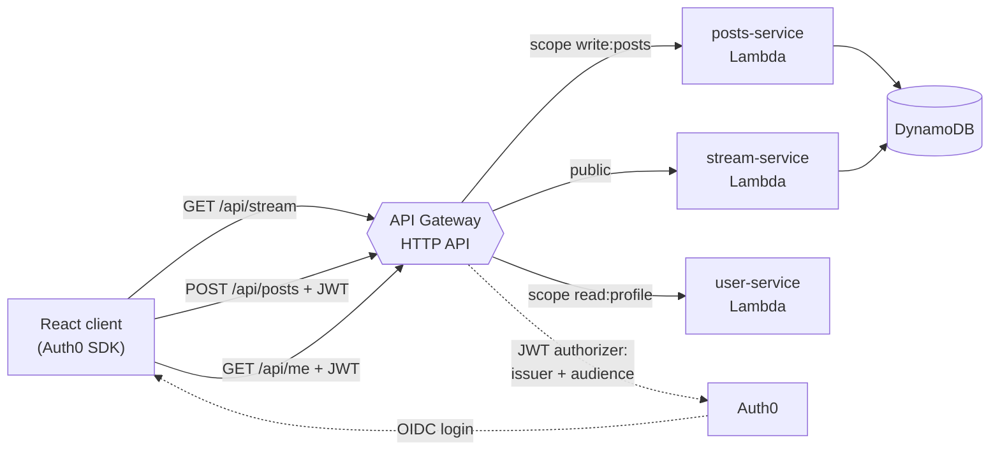

# PulseFeed

**A public micro-posting API built as a secured Spring Boot monolith, then migrated
to three AWS Lambda functions behind API Gateway — with the same contract and the
same Auth0 authorization on both sides.**

The point of the repository is the migration itself: the monolith is kept in place
so the two designs can be compared, and so the reasons for splitting are visible
rather than assumed.

---

## What it does

- Publishes short messages (140 characters maximum) to a single global stream.
- Serves the stream publicly, with no authentication.
- Requires an Auth0 access token carrying the right scope to create a post or read
  your own profile.
- Ships a React client that signs in through Auth0 and calls the API with the token.

---

## Architecture



The Spring Boot monolith in [`monolith/`](monolith) exposes the same four endpoints
against H2, and is the baseline the serverless version was migrated from.

---

## The migration, and what it cost

**Why split at all.** The three capabilities have genuinely different traffic
shapes: the stream is read constantly and by everyone, posting is rare and
authenticated, and the profile lookup runs once per session. On Lambda they scale
and get billed independently, which a single always-on instance cannot do.

**What the split bought.** Each function deploys on its own, and the public read
path no longer shares a process with the authenticated write path.

**What it cost.** Three deployment artifacts instead of one, cold starts on a JVM
runtime, and authorization that now lives in API Gateway configuration rather than
in code — which means a misconfigured route is a security bug that the compiler
cannot catch. That last point is the reason the SAM template sets a
`DefaultAuthorizer`: every route requires a token unless it explicitly opts out.

**What did not change.** The endpoint contract and the Auth0 scopes are identical on
both sides, so the React client works against either without modification.

---

## Security model

Auth0 acts as the OAuth2 authorization server. The monolith validates tokens as a
resource server; API Gateway validates them with a JWT authorizer. Both check
**issuer and audience**, not just the signature — a token minted for a different API
is rejected even though it is correctly signed.

Authorization is per route, by scope:

| Endpoint | Method | Requirement |
|---|---|---|
| `/api/stream` | GET | public |
| `/api/posts` | GET | public |
| `/api/posts` | POST | scope `write:posts` |
| `/api/me` | GET | scope `read:profile` |

`JwtAudienceValidator` in the monolith implements the audience check that Spring
Security does not perform by default.

---

## Stack

| Layer | Technology |
|---|---|
| Monolith | Java 21, Spring Boot, Spring Security (OAuth2 resource server), JPA, H2 |
| Serverless | AWS Lambda (Java), API Gateway HTTP API, DynamoDB, AWS SAM |
| Identity | Auth0 (OIDC, JWT, scopes) |
| Client | React 18, Vite, Auth0 React SDK |
| API docs | springdoc-openapi (Swagger UI) |

---

## Running it locally

### Monolith

Requires Java 21 and Maven.

```bash
export AUTH0_ISSUER_URI="https://YOUR-DOMAIN.auth0.com/"
export AUTH0_AUDIENCE="https://twitterlike-api"
export APP_CORS_ALLOWED_ORIGINS="http://localhost:5173"
cd monolith && mvn spring-boot:run
```

The issuer may be given with or without its trailing slash; the JWKS URL is derived
from it. Swagger UI is served at `http://localhost:8080/swagger-ui.html`.

### Client

Requires Node 20 or newer.

```bash
cd frontend
cp .env.example .env   # fill in the Auth0 values
npm install
npm run dev
```

Without the Auth0 variables the app renders a configuration notice instead of
failing at runtime.

---

## Tests

```bash
cd monolith && mvn verify        # 6 security integration tests
cd frontend && npm test          # 11 client tests
```

24 tests run on every push. The monolith tests exercise the authorization rules
end to end: a public route without a token, a protected route without a token, and
a protected route with a token missing the required scope. The Lambda handlers are
tested per function, and the client covers the draft rules — character budget,
whitespace-only input, the exact 140 boundary, and malformed dates from the API.

The CI pipeline also runs `cfn-lint` over the SAM template, which is how the
missing `DefaultAuthorizer` described above was found.

---

## Deploying

[`infra/sam/template.yaml`](infra/sam/template.yaml) provisions the HTTP API, the
three functions, the DynamoDB table and the Auth0 JWT authorizer.

```bash
cd infra/sam
cp samconfig.example.toml samconfig.toml   # set your region and bucket
sam build && sam deploy --guided
```

Step-by-step notes, including the constraints of a restricted AWS account, are in
[`docs/aws-deploy.md`](docs/aws-deploy.md) and
[`docs/aws-academy-manual-deploy.md`](docs/aws-academy-manual-deploy.md). Auth0
setup is in [`docs/auth0-setup.md`](docs/auth0-setup.md).

---

## Known limitations

- **The stream has no pagination.** `GET /api/stream` returns every post. It is fine
  at demo volume and would need a cursor before real traffic.
- **DynamoDB is queried with a scan.** There is no secondary index on `createdAt`,
  so ordering happens in application code. That is the first thing to fix if the
  table grows.
- **Java on Lambda pays cold starts.** A JVM runtime is a poor fit for a rarely
  invoked function; the write path would be better on a native image or a lighter
  runtime.
- **No integration tests against real AWS.** The handlers are unit tested; the
  deployed wiring was verified manually.
- **The monolith persists to H2 in memory**, so its data resets on restart. It
  exists as a migration baseline, not as a production service.
- **The deployment was exercised on a restricted academic AWS account**, which is
  why the notes mention manual console steps for parts that would normally be
  automated.
