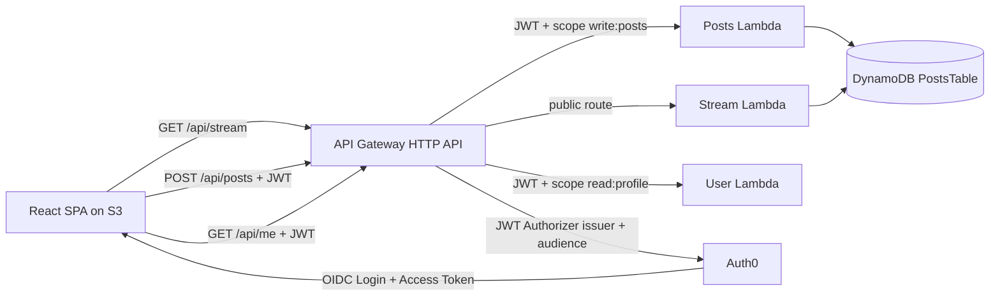

# Secure Twitter-like Application (Monolith -> Serverless Microservices)

This repository contains a full implementation of the assignment:

- Spring Boot monolith with Swagger/OpenAPI and Auth0 JWT security.
- React frontend with Auth0 SDK integration.
- Migration to 3 AWS Lambda microservices (Posts, Stream, User) deployed through AWS SAM.

## Repository structure

- `monolith/` : Spring Boot secure monolith.
- `frontend/` : React + Vite SPA with Auth0 login/logout and API integration.
- `microservices/posts-service/` : Lambda for public post listing and protected post creation.
- `microservices/stream-service/` : Lambda for public global stream.
- `microservices/user-service/` : Lambda for protected user profile endpoint `/api/me`.
- `infra/sam/` : SAM template for API Gateway + Lambda + DynamoDB.
- `docs/` : architecture, Auth0 setup, deployment guide, and test report.

## Assignment requirements mapping

1. Monolith API design:
   - Entities represented: User profile, Post, Global stream.
   - Endpoints:
     - Public: `GET /api/posts`, `GET /api/stream`
     - Protected: `POST /api/posts` (scope `write:posts`), `GET /api/me` (scope `read:profile`)
   - Max post length = 140 characters.

2. Swagger/OpenAPI:
   - Enabled with Springdoc.
   - URL: `http://localhost:8080/swagger-ui.html` or `http://localhost:8080/swagger-ui/index.html`.

3. Frontend application:
   - Login/Logout via Auth0 React SDK.
   - Create new posts (protected endpoint).
   - View global public stream.
   - Calls backend with JWT bearer access tokens.

4. API security with Auth0:
   - Monolith configured as OAuth2 Resource Server.
   - JWT validation by issuer + audience.
   - Route-level authorization by scope.

5. Migration to microservices:
   - 3 independent Java Lambda services:
     - Posts Service
     - Stream Service
     - User Service
   - Secured via API Gateway JWT Authorizer (Auth0).

6. AWS deployment:
   - SAM template included for Lambda + API Gateway + DynamoDB.
   - Frontend deploy guide for S3 static website.

## Local execution

### 1) Monolith

Requirements:
- Java 21
- Maven

Set environment variables (PowerShell):

```powershell
$env:AUTH0_ISSUER_URI="https://YOUR-DOMAIN.auth0.com/"
$env:AUTH0_AUDIENCE="https://twitterlike-api"
$env:APP_CORS_ALLOWED_ORIGINS="http://localhost:5173"
```

Note:
- `AUTH0_ISSUER_URI` can be set with or without the trailing `/`; the backend now normalizes it automatically.
- The backend derives the JWKS URL from `AUTH0_ISSUER_URI`, so you no longer need a separate `AUTH0_JWK_SET_URI`.

Run:

```powershell
cd monolith
mvn spring-boot:run
```

Swagger:
- `http://localhost:8080/swagger-ui.html`

### 2) Frontend

Requirements:
- Node.js 20+
- npm

Create `frontend/.env` from `frontend/.env.example`.

Run:

```powershell
cd frontend
npm install
npm run dev
```

### 3) Microservices

Build each service:

```powershell
cd microservices/posts-service
mvn package
cd ../stream-service
mvn package
cd ../user-service
mvn package
```


## Tests

Automated results and manual checklist are documented in:
- `docs/test-report.md`

Current automated coverage includes:

- Monolith security integration tests
- Lambda handler tests for posts, stream, and user services

## Architecture diagram



Detailed evolution (monolith and microservices):
- `docs/architecture.md`

## Final deliverables

- Live frontend URL (S3): `https://pulsefeed-juan-villegas-2026.s3.amazonaws.com/index.html`
- Monolith Swagger URL or screenshot/export: `REPLACE_WITH_SWAGGER_LINK_OR_IMAGE`
- Video demo (5-8 min): `REPLACE_WITH_VIDEO_LINK`

Current deployment status:

- AWS Lambda microservices deployed manually through AWS Academy console
- API Gateway integrated with Auth0 JWT authorizer
- DynamoDB table used for posts persistence
- Public S3-hosted frontend validated with Auth0 login, `/api/me`, public stream, and protected post creation

Recommended completion order:

1. Confirm API Gateway + Lambda + DynamoDB flow works from localhost frontend.
2. Deploy frontend static files to S3.
3. Update Auth0 and CORS to the S3 URL.
4. Re-test full login, stream, create post, and `/api/me` flow from S3.
5. Replace the placeholders above with the final evidence links.

Evidence:

- Screenshot of Swagger UI from the monolith


- Screenshot of the deployed S3 frontend working


- Screenshot of DynamoDB items after a post is created


-Video demo 
<video controls src="Demo twitterlike app.mp4" title="Title"></video>

