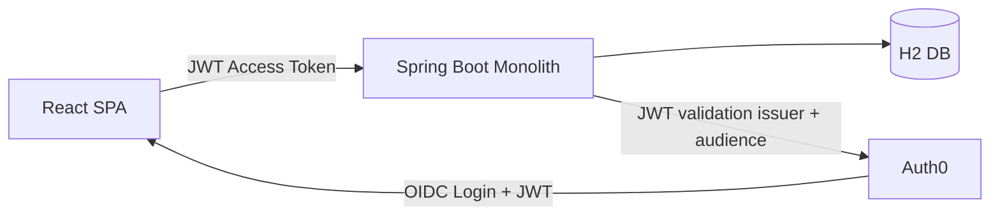
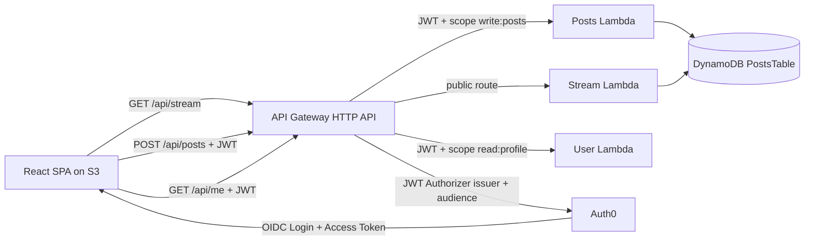

# Architecture Overview

## Monolith phase

## Microservices phase

## Security flow

1. User signs in through Auth0 from the SPA.
2. SPA obtains an access token with audience equal to the backend API identifier.
3. SPA calls protected endpoints with Authorization Bearer token.
4. Monolith validates issuer and audience; route method security enforces scopes.
5. In microservices mode, API Gateway JWT authorizer validates token and route scopes.
